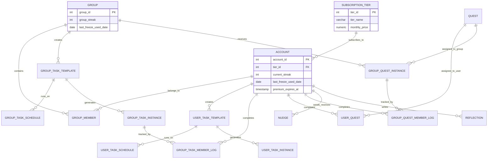

# Project Plan: Gamified Social Productivity App | KAIZEN

## Executive Summary
---------------------

A gamified, offline-first productivity application where users and groups (squads) track personal goals, complete daily quests, and write reflections. Accountability is driven by a shared virtual pet that thrives on the group's collective streak. The system utilizes a robust Template-Instance architecture for recurring tasks, strict member accountability logs, a shop-integrated "Streak Freeze" mechanism, and supports premium subscription tiers.

## Recommended Tech Stack
--------------------------

To handle real-time gamification, background cron jobs, and offline capabilities, a hybrid architecture is required:

| Category | Technology / Tools | Description |
| :--- | :--- | :--- |
| **Frontend** | React Native (Expo), Next.js | iOS/Android and Web platforms. |
| **Offline-First Sync Engine** | WatermelonDB, PowerSync, RxDB | Local SQLite on device; allows offline task completion and instant sync. |
| **Backend API** | Node.js (NestJS) | Provides strict organizational structure (Controllers, Services, Modules). |
| **Database** | PostgreSQL | Relational data, instance histories, and member logs. |
| **ORM** | Prisma, TypeORM | Type-safe database interactions. |
| **Real-time Engine** | Socket.io | Instant "Nudges", live status updates, and pet animations. |
| **Background Jobs** | Redis, BullMQ | Midnight cron jobs for task generation and streak evaluation. |
| **Authentication** | Supabase Auth, Clerk | Secure multi-device sessions and JWTs. |
| **Payments & Subscriptions** | Stripe, RevenueCat | Web payments and In-App Purchases (iOS/Android). |
| **Hosting Strategy** | Vercel, Render, Railway, AWS EC2 | Frontend on Vercel; Backend/Workers on long-running servers for WebSockets/Cron. |

## System Architecture
-----------------------

1.  **Client Layer (Offline-First):** The mobile app writes data directly to a local WatermelonDB instance. The UI updates instantly without waiting for the network.
2.  **Sync Layer:** A background process monitors network status. When online, it automatically pushes local changes to the backend and pulls updates from friends.
3.  **Application Layer (Backend API):** NestJS processes the synced data, validates business logic, handles shop purchases, and writes to PostgreSQL.
4.  **Worker Layer (The Cron Engine):** A continuous Node.js process executing at midnight to generate new task instances, assign quests, and evaluate streak freezes.

## Visual Entity-Relationship Diagram (ERD)
--------------------------------------------

## Text-Based Database Schema (3NF)
------------------------------------

### A. Accounts, Social & Monetization

*   **SUBSCRIPTION_TIER:** tier_id (PK), tier_name (e.g., Free, Pro), monthly_price, max_active_groups, max_custom_tasks
*   **ACCOUNT_STATUS:** account_status_id (PK), account_status_name
*   **ACCOUNT:** account_id (PK), account_status_id (FK), tier_id (FK), username (UQ), email (UQ), password, currency_balance, current_streak, longest_streak, last_freeze_used_date (Date, Allow Null), premium_expires_at (Timestamp, Allow Null), account_created, account_updated
*   **ROLE:** role_id (PK), role_name
*   **GROUP:** group_id (PK), group_name, group_streak, longest_streak, last_freeze_used_date (Date, Allow Null), isShareable, group_created
*   **GROUP_MEMBER:** group_member_id (PK), group_id (FK), account_id (FK), role_id (FK), joined_at
*   **NUDGE:** nudge_id (PK), account_sender_id (FK), account_receiver_id (FK), message, created_at
*   **MOOD:** mood_id (PK), mood_label, mood_description
*   **REFLECTION:** reflection_id (PK), mood_id (FK), account_id (FK), content, created_at

### B. Core Task Engine (User Side)

*   **TASK_STATUS:** task_status_id (PK), status_name (e.g., 1=Pending, 2=Completed, 3=Failed, 4=Frozen), status_description
*   **USER_TASK_TEMPLATE:** user_task_template_id (PK), account_id (FK), title, frequency_type
*   **USER_TASK_SCHEDULE:** user_task_schedule_id (PK), user_task_template_id (FK), day_of_week
*   **USER_TASK_INSTANCE:** user_task_instance_id (PK), user_task_template_id (FK), task_status_id (FK), due_date, completed_at

### C. Core Task Engine (Group Side & Accountability)

*   **GROUP_TASK_TEMPLATE:** group_task_template_id (PK), group_id (FK), title, frequency_type, requires_all_members (Boolean)
*   **GROUP_TASK_SCHEDULE:** group_task_schedule_id (PK), group_task_template_id (FK), day_of_week
*   **GROUP_TASK_INSTANCE:** group_task_instance_id (PK), group_task_template_id (FK), task_status_id (FK), due_date, group_completed_at
*   **GROUP_TASK_MEMBER_LOG:** group_task_member_log_id (PK), group_task_instance_id (FK), account_id (FK), task_status_id (FK), completed_at

### D. Quests Engine

*   **QUEST_TYPE:** quest_type_id (PK), quest_type_name (Solo/Group), quest_type_description
*   **QUEST:** quest_id (PK), quest_type_id (FK), title, description, reward_amount
*   **USER_QUEST:** user_quest_id (PK), quest_id (FK), account_id (FK), assigned_date, quest_status
*   **GROUP_QUEST_INSTANCE:** group_quest_instance_id (PK), group_id (FK), quest_id (FK), assigned_date, quest_status, group_completed_at
*   **GROUP_QUEST_MEMBER_LOG:** group_quest_member_log_id (PK), group_quest_instance_id (FK), account_id (FK), quest_status, completed_at

### E. Pets & Gamification

*   **SPECIES_CATEGORY:** species_category_id (PK), species_category_name, species_category_description
*   **SPECIES_LEVEL:** species_level_id (PK), species_level_name, species_level_description
*   **SPECIES:** species_id (PK), species_category_id (FK), species_level_id (FK), species_name, species_max_level, owned_at
*   **PET:** pet_id (PK), species_id (FK), pet_name, pet_description, isForSale, pet_price
*   **USER_PET:** user_pet_id (PK), pet_id (FK), name, current_level, health, isEquiped, last_equiped_at, owned_at
*   **USER_PET_DETAIL:** user_pet_detail_id (PK), user_pet_id (FK), account_id (FK)
*   **GROUP_PET:** group_pet_id (PK), pet_id (FK), name, current_level, health, isEquiped, last_equiped_at, owned_at
*   **GROUP_PET_DETAIL:** group_pet_detail_id (PK), group_pet_id (FK), group_id (FK)

### F. Shop & Inventory

*   **SHOP_ITEM_TYPE:** shop_item_type_id (PK), item_type_name (e.g., Food, Accessory, Consumable), item_type_description
*   **SHOP_ITEM:** shop_item_id (PK), shop_item_type_id (FK), item_name (e.g., "Streak Freeze"), item_description, item_price
*   **USER_INVENTORY:** user_inventory_id (PK), account_id (FK), shop_item_id (FK), quantity
*   **GROUP_INVENTORY:** group_inventory_id (PK), group_id (FK), shop_item_id (FK), quantity

## Implementation Flow & Logic
-------------------------------

### 6.1 Offline-First Sync & Device State

When a user checks off a task while on the subway (offline), the change is saved locally via WatermelonDB. Once cell service returns, the sync engine fires a batch API request to NestJS. The backend processes the timestamps and securely updates PostgreSQL, ensuring no data loss occurs.

### 6.2 The Midnight Cron Worker

A background worker executes daily at 00:00 system time:

1.  **Assess Yesterday:** Scans USER_TASK_INSTANCE, GROUP_TASK_INSTANCE, and Quest logs from the previous day for "Pending" items.
2.  **Generate Today:** Scans TASK_SCHEDULE tables to generate today's instances, creates accountability logs, and assigns daily quests.

### 6.3 Group Completion Logic (Accountability)

When a member syncs a "Completed" group task:

1.  Backend updates their GROUP_TASK_MEMBER_LOG to COMPLETED.
2.  Backend queries: Are there any 'PENDING' rows left for this instance?
3.  If 0 pending rows remain, the master GROUP_TASK_INSTANCE is marked completed, the GROUP_PET receives experience, and all users receive currency.

### 6.4 The Streak Freeze Mechanism

If the Cron Worker detects uncompleted tasks for a User/Group:

1.  **Inventory Check:** Checks USER_INVENTORY for a "Streak Freeze" item (quantity > 0).
2.  **Cooldown Check:** Checks last_freeze_used_date (Must be NULL or > 7 days ago).
3.  **Execute Freeze:** Deducts 1 from inventory, updates last_freeze_used_date to today, marks uncompleted tasks as **"Frozen"**. Streak is preserved.
4.  **Execute Penalty:** If not eligible, tasks are marked **"Failed"**, streak resets to 0, and Pet Health is reduced.

### 6.5 Premium Subscription Flow

When a user purchases a Pro tier via Apple App Store or Google Play, RevenueCat catches the receipt and sends a webhook to the NestJS backend. The backend updates the user's tier_id and sets premium_expires_at. The backend now allows this user to create extra custom tasks and join more groups based on the limits defined in SUBSCRIPTION_TIER.

### 6.6 Real-time Nudges

Users view their group dashboard to see who is holding up the Group Quest. Clicking "Nudge" saves to the NUDGE table and fires a WebSocket event, triggering an instant push notification on the slacking friend's device.